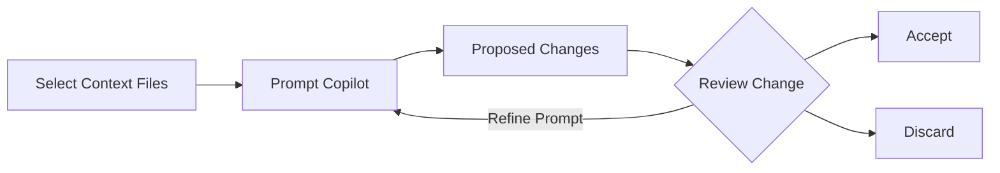

## Passo 3: Trabalhando ainda _mais rápido_ com o Copilot Edit Mode

Nos passos anteriores, usamos recursos do Copilot que exigem mais orientação manual e produziram resultados principalmente localizados. Agora, vamos explorar o **Edit Mode** do Copilot, um recurso que permite trabalhar de forma mais holística no nosso repositório.

### 📖 Teoria: Copilot Edit Mode

O **Edit Mode** e o **Agent Mode** do Copilot permitem aplicar mudanças orientadas por **linguagem natural** em **múltiplos arquivos**, porém existem algumas diferenças entre eles.

Neste passo, vamos focar no **Edit Mode** e explorar o **Agent Mode** no próximo passo.

O Edit Mode é melhor utilizado para tarefas **bem definidas** onde você **conhece o escopo** das mudanças necessárias.

#### Como o Edit Mode funciona



1. **Definir Contexto**: Selecione os arquivos que o Copilot deve considerar nas suas alterações
1. **Dar Prompt ao Copilot**: Use linguagem natural para descrever as mudanças necessárias.
1. **Revisar Mudanças**: Veja as alterações propostas diretamente no seu código.
1. **Aceitar ou Descartar**: Revise cada edição sugerida e escolha quais manter.
1. **Iterar**: Se necessário, forneça instruções de acompanhamento para refinar as mudanças.

### :keyboard: Atividade: Use o Copilot para adicionar uma nova funcionalidade! :rocket:

Nosso site lista atividades, mas está mantendo a lista de convidados em segredo 🤫 

Vamos usar o Copilot para alterar o site e exibir os estudantes inscritos em cada atividade!

1. Na parte inferior da janela do Copilot Chat, use o dropdown para mudar para o modo **Edit**.

   

1. Abra os arquivos relacionados à nossa página web e arraste cada janela do editor (ou arquivo) para o painel de chat, informando ao Copilot para usá-los como contexto.

   - `src/static/app.js`
   - `src/static/index.html`
   - `src/static/styles.css`

   

   > 💡 **Dica:** Você também pode usar o botão **Add Context...** para fornecer outras fontes de itens de contexto, como uma issue do GitHub, toda a base de código, ou os resultados de uma janela de terminal.

1. Peça ao Copilot para atualizar nosso projeto para exibir os participantes atuais das atividades. Aguarde um momento para as sugestões de edição chegarem e serem aplicadas.

   > 
   >
   > ```prompt
   > Ei Copilot, você pode editar os cards de atividades para adicionar uma seção de participantes?
   > Ela vai mostrar quais participantes já estão inscritos naquela atividade como uma lista com marcadores.
   > Lembre-se de deixar bonito!
   > ```

   - Um ícone extra apareceu ao lado dos nomes dos arquivos e janelas abertas do editor indicando que eles têm edições sugeridas.
   - Um painel de edições sugeridas apareceu no canto inferior direito da janela do editor fornecendo controles para navegar até as mudanças recomendadas.

      

      


1. Antes de simplesmente aceitar as mudanças, por favor verifique nosso site novamente e confirme que tudo está atualizado conforme esperado. Aqui está um exemplo de um card de atividade atualizado. Você pode precisar reiniciar o app ou atualizar a página.

   

   > 🪧 **Nota:** Seu card de atividade pode parecer diferente. O Copilot nem sempre produzirá os mesmos resultados.

   <details>
   <summary>Precisa de ajuda? 🤷</summary><br/>
   Se o site não estiver carregando, aqui estão algumas coisas para verificar.

   - Reinicie o Debugger do VS Code para garantir que a versão mais recente do site está sendo servida.
   - Se você esqueceu a URL, ou fechou a janela, por favor revise o passo 1.
   - Tente fazer um hard refresh na página ou abrir em uma janela privada para baixar uma cópia nova.

   </details>

1. Agora que confirmamos que nossas mudanças estão boas, use o painel para navegar por cada edição sugerida e pressione **Keep** para aplicar a mudança.

   > 💡 **Dica:** Você pode aceitar as mudanças diretamente, modificá-las, ou fornecer instruções adicionais para refiná-las usando a interface de chat.

1. Com nossa nova funcionalidade completa, por favor faça o **commit** e **push** das mudanças para o GitHub.

1. Aguarde um momento para a Mona verificar seu trabalho, fornecer feedback e compartilhar a próxima lição.


<details>
<summary>Tendo problemas? 🤷</summary><br/>

Se você não receber feedback, aqui estão algumas coisas para verificar:

- Certifique-se de fazer commit das mudanças no diretório `src/static/` para o branch `accelerate-with-copilot` e push/sincronização para o GitHub.
- Se a Mona encontrou um erro, simplesmente faça uma correção e envie suas mudanças novamente. A Mona verificará seu trabalho quantas vezes forem necessárias.

</details>
